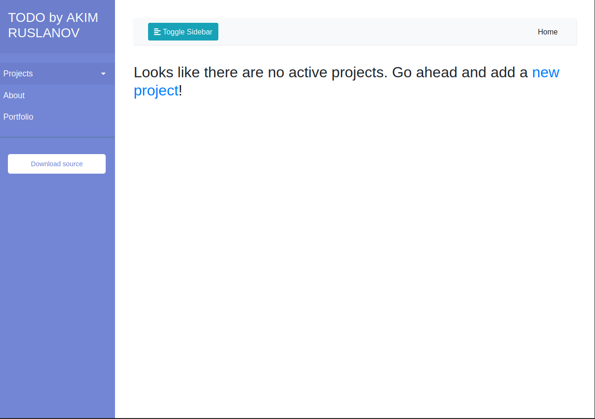

# todo_flask
A simple web todo app using flask

Here are some sample screenshots of the UI:

This is the home page where you are able to see all your tasks filtered and grouped by projects. This was specifically designed for people doing multiple projects at once and needing a way to note what needs to be done for each. Specifically, I was trying to make something I would use, because when working on multiple coding projects, I would need to remember different functions to implement, different technologies to research and different problems to debug. This way, I can organize everything by the projects.

Here you can see, a project was already made. So we are able to add a new task for the project

You can now see the task was added (and sidebar is gone by clicking on the top left button)

And lastly, here is a simple about page:

